# **All-jellyfin-media-server**

<div style="text-align: center">
    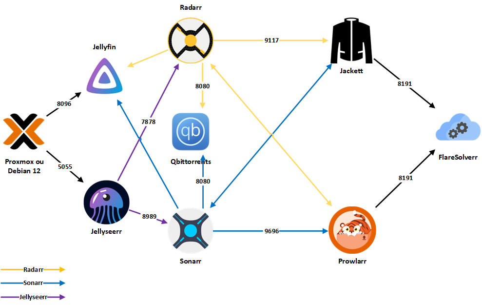
</div>

Bienvenue dans le dépôt All-jellyfin-media-server ! Ce dépôt contient tout ce dont vous avez besoin pour créer votre propre serveur média Jellyfin avec Sonarr, Radarr, Jellyseerr, Prowlarr, Jackett, qBittorrent et Gluetun (VPN) dans une configuration Docker Compose. Nous désignerons l’ensemble de ces conteneurs sous le nom **Isyrr** pour simplifier.


 

[](https://github.com/Morzomb/All-jellyfin-media-server/commits/master)


> [!NOTE] 
> **Access the repository in [English](README.md)**

## **Table des matières :**

- [**All-jellyfin-media-server**](#all-jellyfin-media-server)
  - [**Table des matières :**](#table-des-matières-)
  - [**À quoi sert Isyrr ?**](#à-quoi-sert-isyrr-)
    - [**Jellyfin**](#jellyfin)
    - [**Jellyseerr**](#jellyseerr)
    - [**Sonarr**](#sonarr)
    - [**Radarr**](#radarr)
    - [**Jackett**](#jackett)
    - [**Flaresolverr**](#flaresolverr)
    - [**Prowlarr**](#prowlarr)
    - [**qBittorrent**](#qbittorrent)
    - [**Gluetun (VPN)**](#gluetun-vpn)
- [**Prérequis**](#prérequis)
  - [**Docker**](#docker)
    - [**Utiliser Docker Compose :**](#utiliser-docker-compose-)
  - [**NVIDIA**](#nvidia)
    - [**Première méthode**](#première-méthode)
  - [**Vérification finale**](#vérification-finale)
  - [**Deuxième méthode**](#deuxième-méthode)
- [**VPN**](#vpn)
  - [**NORD**](#nord)
  - [**PROTON**](#proton)
  - [**Dépannage VPN**](#dépannage-vpn)
- [**Installation**](#installation)
  - [**1. Installation de base**](#1-installation-de-base)
  - [**2. Installation avec uniquement NVIDIA**](#2-installation-avec-uniquement-nvidia)
  - [**3. Installation avec NVIDIA et VPN**](#3-installation-avec-nvidia-et-vpn)
- [**Accéder aux Applications**](#accéder-aux-applications)
- [**Guide de Configuration pour les Interfaces Web uniquement**](#guide-de-configuration-pour-les-interfaces-web-uniquement)
  - [**qBittorrent**](#qbittorrent-1)
    - [**Configuration des Catégories**](#configuration-des-catégories)
  - [**Radarr**](#radarr-1)
    - [**Gestion des Médias**](#gestion-des-médias)
    - [**Clients de Téléchargement**](#clients-de-téléchargement)
    - [**Indexer Jackett (Optionnelle)**](#indexer-jackett-optionnelle)
  - [**Sonarr**](#sonarr-1)
    - [**Gestion des Médias**](#gestion-des-médias-1)
    - [**Clients de Téléchargement**](#clients-de-téléchargement-1)
    - [**Indexer Jackett (Optionnelle)**](#indexer-jackett-optionnelle-1)
  - [**Prowlarr**](#prowlarr-1)
    - [**Configurer les Indexeurs de Torrents**](#configurer-les-indexeurs-de-torrents)
    - [**Configurer FlareSolverr**](#configurer-flaresolverr)
    - [**Configurer Radarr**](#configurer-radarr)
    - [**Configurer Sonarr**](#configurer-sonarr)
  - [**Jellyfin**](#jellyfin-1)
    - [**Configuration Initiale**](#configuration-initiale)
    - [**Ajouter des utilisateurs à Jellyfin**](#ajouter-des-utilisateurs-à-jellyfin)
  - [**Jellyseerr**](#jellyseerr-1)
    - [**Connexion / Configuration**](#connexion--configuration)
    - [**Intégration avec Radarr**](#intégration-avec-radarr)
    - [**Intégration avec Sonarr**](#intégration-avec-sonarr)
- [**Mise à jour des applications**](#mise-à-jour-des-applications)
- [**Avertissement**](#avertissement)

## **À quoi sert Isyrr ?**

Ce dépôt vous permet de créer votre propre serveur média Jellyfin avec tous les outils nécessaires pour gérer vos films, séries TV, musique et eBooks. Il inclut également des outils pour automatiser le téléchargement de nouveaux contenus et protéger votre confidentialité grâce à un VPN.

Isyrr utilise Docker et Docker Compose pour déployer les services. Les fichiers Docker Compose se trouvent dans les répertoires avec-vpn et sans-vpn.

> [!IMPORTANT]  
> Pour utiliser Docker Compose, assurez-vous que Docker est installé sur votre système.

---

### **Jellyfin**

[Jellyfin](https://jellyfin.org/) est un logiciel de serveur multimédia open-source qui vous permet de diffuser vos films, séries TV, musique et eBooks sur tous vos appareils. Il est compatible avec de nombreux types de fichiers multimédia et prend en charge le streaming vers divers appareils.

<div style="text-align: center">
    
</div>

### **Jellyseerr**

[Jellyseerr](https://github.com/Fallenbagel/jellyseerr) est une application open-source qui vous permet d'automatiser la gestion de votre serveur multimédia Jellyfin. Elle fonctionne en surveillant votre bibliothèque Jellyfin et en recherchant et téléchargeant automatiquement de nouveaux contenus en fonction de vos préférences. Jellyseerr prend en charge l'intégration avec divers autres outils, tels que Sonarr et Radarr, pour offrir une expérience fluide dans la gestion de votre collection multimédia.

<div style="text-align: center"> 
     
</div>

### **Sonarr**

[Sonarr](https://sonarr.tv/) est un logiciel de gestion de séries TV qui vous permet de rechercher, télécharger et gérer automatiquement vos séries TV préférées. Il fonctionne avec de nombreux types de trackers et de clients torrent et prend en charge le téléchargement automatique de sous-titres.

<div style="text-align: center">
    
</div>

### **Radarr**

[Radarr](https://radarr.video/) est un logiciel de gestion de films qui vous permet de rechercher, télécharger et gérer automatiquement vos films préférés. Il fonctionne avec de nombreux types de trackers et de clients torrent et prend en charge le téléchargement automatique de sous-titres.

<div style="text-align: center">
    
</div>

### **Jackett**

[Jackett](https://github.com/Jackett/Jackett) est un logiciel proxy pour les trackers torrent qui vous permet de rechercher des fichiers torrent sur de nombreux trackers depuis un seul endroit. Il fonctionne avec de nombreux types de clients torrent et prend en charge l'authentification ainsi que la recherche avancée.

<div style="text-align: center">
    
</div>

### **Flaresolverr**

[Flaresolverr](https://github.com/FlareSolverr/FlareSolverr) est un logiciel open-source qui vous permet de contourner les restrictions de streaming sur les sites de partage de vidéos. Il fonctionne en résolvant les liens de streaming et en contournant les blocages géographiques et les restrictions de lecture.

<div style="text-align: center">
    
</div>

### **Prowlarr**

[Prowlarr](https://github.com/Prowlarr/Prowlarr) est un logiciel de gestion des téléchargements qui vous permet de rechercher et de télécharger automatiquement des fichiers provenant de diverses sources, y compris des trackers torrent, des newsgroups et des sites de téléchargement direct.

<div style="text-align: center">
    
</div>

### **qBittorrent**

[qBittorrent](https://www.qbittorrent.org/) est un logiciel open-source de client BitTorrent qui vous permet de télécharger des fichiers torrent. Il est léger, facile à utiliser et prend en charge de nombreuses fonctionnalités avancées telles que la recherche de torrents intégrée, le chiffrement, la création de torrents et la prise en charge des trackers privés.

<div style="text-align: center">
    
</div>

### **Gluetun (VPN)**

[Gluetun](https://github.com/qdm12/gluetun) est un logiciel open-source de client VPN qui vous permet de vous connecter à des serveurs VPN. Il est facile à utiliser et prend en charge de nombreuses fonctionnalités avancées telles que le transfert de port, la protection contre les fuites DNS et la prise en charge de plusieurs protocoles VPN.

<div style="text-align: center">
  
</div>

<div style="text-align: center">
    
    
</div>

---

# **Prérequis**

> [!NOTE]  
> Ce service nécessite une machine avec au moins 4 cœurs de CPU et 8 Go de RAM. Il est également fortement recommandé d'avoir une carte graphique NVIDIA pour des performances optimales.

La première chose à faire est de mettre à jour votre système :

```bash
sudo apt update && sudo apt upgrade
```

## **Docker**

Pour installer Docker sur votre système, utilisez les commandes suivantes :

Téléchargez le script avec cette commande :
```bash
curl -fsSL https://get.docker.com -o get-docker.sh
```

Puis exécutez le script avec cette commande :
```bash
sh get-docker.sh
```

> [!TIP]
> Je recommande de donner les droits d'administration Docker à votre utilisateur :
> ```bash
> usermod -aG docker <user>
> ```
> Après cette commande, déconnectez-vous et reconnectez-vous.


### **Utiliser Docker Compose :**

Pour utiliser Docker Compose avec ce dépôt, vous devez d'abord choisir si vous souhaitez utiliser la version avec VPN ou sans VPN. Ensuite, naviguez vers le répertoire correspondant (avec-vpn ou sans-vpn) et exécutez la commande suivante :

```bash
docker-compose up -d
```

Pour arrêter la stack :

```bash
docker-compose down
```

**[`^        retour au sommaire        ^`](#table-of-contents)**

## **NVIDIA**

> [!WARNING]  
> Veuillez noter qu'en raison des mises à jour récentes de Debian 12 et de Proxmox, les pilotes NVIDIA sont devenus instables. Par conséquent, il existe deux méthodes pour installer les pilotes.

Pour mon serveur, il possède une carte graphique NVIDIA GeForce 1060. Le système d'exploitation installé est Proxmox 8.1.10, basé sur Debian 12. Si vous devez vérifier la compatibilité, consultez le [matrice de support NVIDIA](https://developer.nvidia.com/video-encode-and-decode-gpu-support-matrix-new).

### **Première méthode**

Rendez-vous sur le [site web de NVIDIA](https://www.nvidia.com/en-us/drivers/) et sélectionnez votre carte graphique. Voici un exemple :


<div style="text-align: center">
    
</div>

---

<div style="text-align: center">
    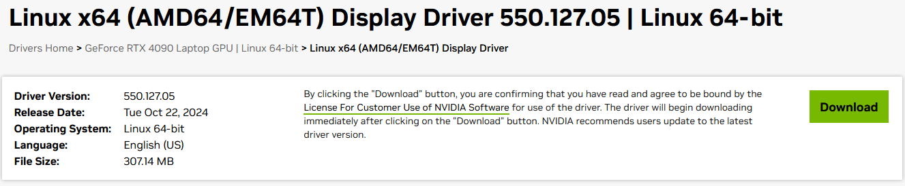
</div>

Copiez le lien de téléchargement pour le pilote, vous devriez obtenir un lien qui ressemble à ceci :

```text
https://us.download.nvidia.com/XFree86/Linux-x86_64/550.127.05/NVIDIA-Linux-x86_64-550.127.05.run
```

1. Mise à jour et préparation du système

Mettez à jour et améliorez votre système pour vous assurer que tous les paquets sont à jour.

```bash
apt update
apt upgrade
```

2. Téléchargement et préparation du pilote NVIDIA

Téléchargez le pilote NVIDIA requis.


```bash
wget https://us.download.nvidia.com/XFree86/Linux-x86_64/550.127.05/NVIDIA-Linux-x86_64-550.127.05.run
chmod u+x NVIDIA-Linux-x86_64-550.127.05.run
```

3. Installer les clés et le dépôt du NVIDIA Container Toolkit

Ajoutez la clé GPG et configurez le dépôt pour les outils de conteneur NVIDIA.

```bash
curl -fsSL https://nvidia.github.io/libnvidia-container/gpgkey | gpg --dearmor -o /usr/share/keyrings/nvidia-container-toolkit-keyring.gpg \
  && curl -s -L https://nvidia.github.io/libnvidia-container/stable/deb/nvidia-container-toolkit.list | \
    sed 's#deb https://#deb [signed-by=/usr/share/keyrings/nvidia-container-toolkit-keyring.gpg] https://#g' | \
    tee /etc/apt/sources.list.d/nvidia-container-toolkit.list
```

4. Mettre à jour les dépôts et installer les packages nécessaires

Mettez à jour les dépôts et installez les packages nécessaires pour la compilation.

```bash
apt update
apt install pve-headers gcc make
```

5. Installer le pilote NVIDIA

Installez le pilote NVIDIA téléchargé en utilisant le chemin source du noyau.

```bash
./NVIDIA-Linux-x86_64-550.127.05.run --kernel-source-path /usr/src/linux-headers-6.8.12-3-pve/
```

6. Installer et configurer le NVIDIA Container Toolkit

Installez le NVIDIA Container Toolkit et configurez-le pour Docker.

```bash
apt install nvidia-container-toolkit
nvidia-ctk runtime configure --runtime=docker
```

7. Configurer le démon Docker

Éditez le fichier de configuration Docker pour configurer le runtime et le chemin des données.


```bash
nano /etc/docker/daemon.json
```

Ajoutez le contenu suivant :

```json
{
    "data-root": "/<YOUR_PATH>/docker",
    "runtimes": {
        "nvidia": {
            "args": [],
            "path": "nvidia-container-runtime"
        }
    }
}
```

8. Redémarrer

Votre environnement est maintenant prêt à exécuter des conteneurs Docker avec le support GPU NVIDIA.

## **Vérification finale**

Assurez-vous que le GPU est correctement détecté :

```
root@pve:~#nvidia-smi
+-----------------------------------------------------------------------------+
| NVIDIA-SMI 525.147.05   Driver Version: 525.147.05   CUDA Version: 12.0     |
|-------------------------------+----------------------+----------------------+
| GPU  Name        Persistence-M| Bus-Id        Disp.A | Volatile Uncorr. ECC |
| Fan  Temp  Perf  Pwr:Usage/Cap|         Memory-Usage | GPU-Util  Compute M. |
|                               |                      |               MIG M. |
|===============================+======================+======================|
|   0  NVIDIA GeForce ...  On   | 00000000:01:00.0 Off |                  N/A |
| N/A   47C    P8     9W /  78W |      1MiB /  3072MiB |      0%      Default |
|                               |                      |                  N/A |
+-------------------------------+----------------------+----------------------+

+-----------------------------------------------------------------------------+
| Processes:                                                                  |
|  GPU   GI   CI        PID   Type   Process name                  GPU Memory |
|        ID   ID                                                   Usage      |
|=============================================================================|
|  No running processes found                                                 |
+-----------------------------------------------------------------------------+
```

**[`^        retour au sommaire        ^`](#table-of-contents)**

## **Deuxième méthode**

> [!WARNING]  
> Cette méthode est obsolète car elle peut provoquer d'importants conflits si vous mettez fréquemment à jour votre serveur.

1. Votre fichier `/etc/apt/sources.list` doit ressembler à ceci :
```bash
deb http://ftp.debian.org/debian bookworm main contrib
deb http://ftp.debian.org/debian bookworm-updates main contrib

# Proxmox VE pve-no-subscription repository provided by proxmox.com,
# NOT recommended for production use
deb http://download.proxmox.com/debian/pve bookworm pve-no-subscription

# security updates
deb http://security.debian.org/debian-security bookworm-security main contrib

# Debian Bookworm
### Add this line
deb http://deb.debian.org/debian/ bookworm main contrib non-free non-free-firmware
```

Et : 

```bash
curl -fsSL https://nvidia.github.io/libnvidia-container/gpgkey | gpg --dearmor -o /usr/share/keyrings/nvidia-container-toolkit-keyring.gpg \
  && curl -s -L https://nvidia.github.io/libnvidia-container/stable/deb/nvidia-container-toolkit.list | \
    sed 's#deb https://#deb [signed-by=/usr/share/keyrings/nvidia-container-toolkit-keyring.gpg] https://#g' | \
    tee /etc/apt/sources.list.d/nvidia-container-toolkit.list
```

2. Mettre à jour les dépôts :

```bash
apt update
```

3. Installer les mises à jour :

```bash
apt upgrade
```

4. Installer les pilotes NVIDIA :

Uniquement pour l'environnement Proxmox :

```bash
apt install pve-headers
```

Ensuite :

```bash
apt install libnvidia-cfg1 nvidia-kernel-source nvidia-kernel-common nvidia-driver nvidia-container-toolkit

nvidia-ctk runtime configure --runtime=docker
```

5. Configurer le démon Docker

Éditez le fichier de configuration Docker pour configurer le runtime et le chemin des données.

```bash
nano /etc/docker/daemon.json
```

Ajoutez le contenu suivant :

```json
{
    "data-root": "/<YOUR_PATH>/docker",
    "runtimes": {
        "nvidia": {
            "args": [],
            "path": "nvidia-container-runtime"
        }
    }
}
```

6. Redémarrer

7. Ensuite, entrez **nvidia-smi**, ce qui devrait afficher :

```
root@pve:~#nvidia-smi
+-----------------------------------------------------------------------------+
| NVIDIA-SMI 525.147.05   Driver Version: 525.147.05   CUDA Version: 12.0     |
|-------------------------------+----------------------+----------------------+
| GPU  Name        Persistence-M| Bus-Id        Disp.A | Volatile Uncorr. ECC |
| Fan  Temp  Perf  Pwr:Usage/Cap|         Memory-Usage | GPU-Util  Compute M. |
|                               |                      |               MIG M. |
|===============================+======================+======================|
|   0  NVIDIA GeForce ...  On   | 00000000:01:00.0 Off |                  N/A |
| N/A   47C    P8     9W /  78W |      1MiB /  3072MiB |      0%      Default |
|                               |                      |                  N/A |
+-------------------------------+----------------------+----------------------+

+-----------------------------------------------------------------------------+
| Processes:                                                                  |
|  GPU   GI   CI        PID   Type   Process name                  GPU Memory |
|        ID   ID                                                   Usage      |
|=============================================================================|
|  No running processes found                                                 |
+-----------------------------------------------------------------------------+
```

Il pourrait y avoir des erreurs pendant l'installation ; il est préférable d'utiliser nvidia-patch :

```bash
git clone https://github.com/keylase/nvidia-patch.git

cd nvidia-patch
./patch.sh
```

> [!CAUTION]  
> Si vous devez redémarrer l'installation, voici comment désinstaller les pilotes NVIDIA :
> 
> ```bash
> apt remove nvidia-driver
> apt purge *nvidia*
> apt autoremove
> apt clean
> apt search nvidia-driver
> apt autoremove glx-alternative-nvidia libegl-nvidia0 libgl1-nvidia-glvnd-glx libgles-nvidia1 libgles-nvidia2 libglx-nvidia0 nvidia-alternative nvidia-detect nvidia-driver nvidia-driver-bin nvidia-driver-libs nvidia-kernel-dkms nvidia-kernel-source nvidia-open-kernel-dkms nvidia-open-kernel-source xserver-xorg-video-nvidia
> ```
> Si des fichiers résiduels restent, recherchez-les en utilisant `apt search nvidia-driver`

**[`^        retour au sommaire        ^`](#table-of-contents)**

# **VPN**

Maintenant, nous allons voir comment configurer le VPN. Personnellement, j'utiliserai ProtonVPN et NordVPN, mais vous pouvez trouver de nombreux autres fournisseurs de VPN [ICI](https://github.com/qdm12/gluetun-wiki/tree/main/setup/providers).

## **NORD**

Tout d'abord, vous devez vous connecter au site Web de Nord VPN.

1. Allez sur les services de Nord VPN :

<div style="text-align: center">
    
</div>

2. Sélectionnez la configuration manuelle de NordVPN :

<div style="text-align: center">
    
</div>

3. Vous pouvez maintenant récupérer votre identifiant et votre mot de passe pour le conteneur Gluetun :

<div style="text-align: center">
    
</div>

---

## **PROTON**

Allez sur le site de [Proton VPN](https://account.protonvpn.com/downloads).

1. Allez dans la section Téléchargement :

<div style="text-align: center">
    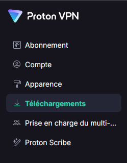
</div>

2. Configurez votre VPN manuellement en sélectionnant un nom de système d'exploitation à utiliser, et assurez-vous d'activer NAT-PMP. Enfin, sélectionnez le pays souhaité :

<div style="text-align: center">
    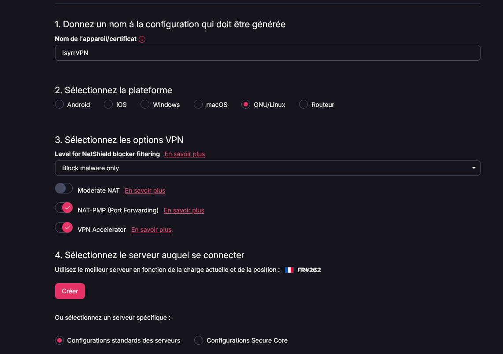
</div>

3. Vous pouvez maintenant rassembler vos informations pour la configuration du conteneur Gluetun :

<div style="text-align: center">
    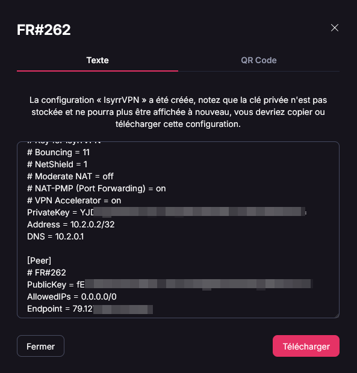
</div>

> [!CAUTION]  
> Assurez-vous d'avoir soit téléchargé le fichier, soit copié son contenu dans un fichier texte, car certaines informations ne seront plus disponibles après avoir cliqué sur "Fermer".

## **Dépannage VPN** 

Une fois Docker lancé, vous pouvez tester votre VPN avec la commande suivante :

```bash
docker exec qbittorrent curl -s https://api.ipify.org/
# Résultat
94.101.115.63
```

De mon côté, cela m'affiche une adresse IP en Belgique :

<div style="text-align: center">
    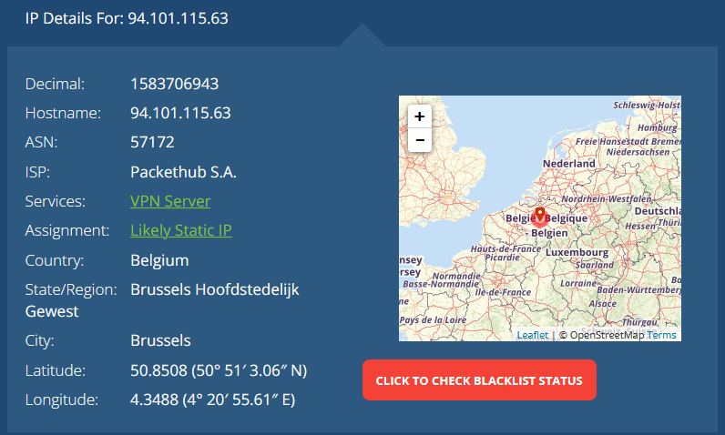
</div>

**[`^        retour au sommaire        ^`](#table-of-contents)**

---

# **Installation**

Tout d'abord, clonez le dépôt :

```bash
git clone https://github.com/Morzomb/All-jellyfin-media-server.git
cd All-jellyfin-media-server/
```

Pour l'installation, j'ai créé uniquement trois versions du fichier `docker-compose`.

Avant de procéder, rendez-vous dans le fichier `.env` situé dans le répertoire `compose_files/` et complétez-le avec les informations nécessaires. Ce fichier doit toujours être à la racine du fichier `docker-compose` que vous allez lancer.

```yaml
# BASE
COMMON_PATH=/VOTRE_CHEMIN/Isyrr
TZ=Europe/Paris

# Décommentez les lignes ci-dessous pour activer la configuration VPN correspondante

# NORD VPN
# OPENVPN_USER=nom_utilisateur  # Votre nom d'utilisateur pour NordVPN
# OPENVPN_PASSWORD=mot_de_passe  # Votre mot de passe pour NordVPN
# SERVER_REGIONS=Belgique  # Choisissez la région du serveur (ici la Belgique)

# PROTON VPN
# ENDPOINT_IP=ADRESSE_IP_PEER  # L'adresse IP du serveur VPN
# WIREGUARD_ADDR=Adresse_Interface  # L'adresse de l'interface WireGuard
# ENDPOINT_PORT=51820  # Le port par défaut est 51820, mais confirmez s'il est différent
# DNS_ADDRESS=Interface_DNS  # L'adresse DNS pour ProtonVPN
# PUBLIC_KEY=Clef_Publique_PEER  # La clé publique de l'autre pair
# PRIVATE_KEY=Clef_Privée_Interface  # Votre clé privée
```

> [!WARNING]  
> Assurez-vous de décommenter et de configurer les paramètres en fonction du service VPN que vous utilisez. Cette étape est essentielle pour établir une connexion VPN correcte.

## **1. Installation de base**

Installation standard sans `VPN` ni `NVIDIA` :

Pour commencer l'installation, exécutez :

```bash
cd compose_files/
docker compose -f docker-compose.yaml up -d
```

[Accédez au fichier ici](compose_files/docker-compose.yaml)

## **2. Installation avec uniquement NVIDIA**

Installation standard avec `NVIDIA` mais sans `VPN` :

Pour commencer l'installation, exécutez :

```bash
cd compose_files/
docker compose -f docker-compose-nvidia.yaml up -d
```

[Accédez au fichier ici](compose_files/docker-compose-nvidia.yaml)

## **3. Installation avec NVIDIA et VPN**

> [!WARNING]  
> Si vous utilisez cette méthode, remplissez le fichier `.env` situé dans `compose_files/VPN`.

Installation standard avec à la fois `VPN` et `NVIDIA` :

Pour commencer l'installation, exécutez :

```bash
cd compose_files/VPN/
docker compose -f docker-compose-<YOUR_VPN>-vpn.yaml up -d
```
[Go to the file here](compose_files/VPN/)

**[`^        retour au sommaire        ^`](#table-of-contents)**

# **Accéder aux Applications**

Une fois les applications déployées, vous pouvez y accéder via les adresses suivantes :

> [!IMPORTANT]  
> Remplacez `localhost` par l'adresse IP de votre machine ou serveur distant si nécessaire.

* Jellyfin : http://localhost:8096
* Sonarr : http://localhost:8989
* Radarr : http://localhost:7878
* Jackett : http://localhost:9117
* Prowlarr : http://localhost:9696
* qBittorrent : http://localhost:8080

Gluetun (Nord VPN) sera automatiquement configuré pour être utilisé avec les applications.

# **Guide de Configuration pour les Interfaces Web uniquement**

> [!IMPORTANT]  
> Tous les liens contenant le nom du conteneur peuvent être remplacés par l'IP du serveur ou `localhost`. De plus, remplacez `/COMMON_PATH/` par le chemin que vous avez configuré dans le fichier `.env`.

## **qBittorrent**

1. Ouvrez l'interface Web en cliquant sur l'icône de l'application dans l'onglet **DOCKER** et sélectionnez **WebUI**.
2. Connectez-vous avec les identifiants par défaut :
   - **Nom d'utilisateur** : `admin`
   - **Mot de passe** : `adminadmin`
   
<div style="text-align: center">
    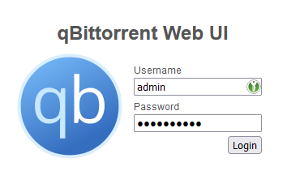
</div>

   *Remarque : Les identifiants par défaut peuvent avoir changé, veuillez consulter la documentation pour toute mise à jour à ce sujet.*

3. Une fois connecté, cliquez sur l'icône d'engrenage pour accéder aux **Options**.
4. Sous l'onglet **Téléchargements**, configurez les paramètres de sauvegarde comme suit :
   - **Mode de gestion des torrents par défaut** : `Automatique` (nécessaire pour que les chemins de sauvegarde basés sur les catégories fonctionnent)
   - **Lorsque la catégorie de torrent change** : `Relocaliser le torrent`
   - **Lorsque le chemin de sauvegarde par défaut change** : `Relocaliser les torrents affectés`
   - **Lorsque le chemin de sauvegarde de la catégorie change** : `Relocaliser les torrents affectés`
   - **Chemin de sauvegarde par défaut** : `/downloads`
5. Cliquez sur **SAUVEGARDER**.

<div style="text-align: center">
    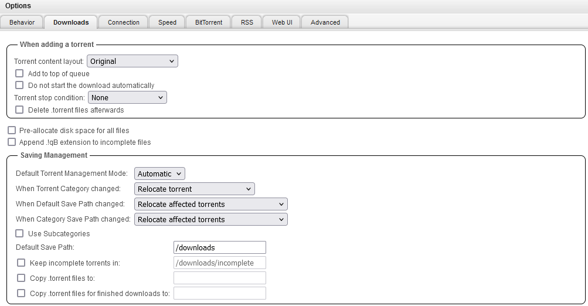
</div>

### **Configuration des Catégories**

1. Dans l'interface Web, développez **CATEGORIES** dans le menu de gauche. Faites un clic droit sur **Tous** et sélectionnez **Ajouter une catégorie...**.
2. Dans la fenêtre **Nouvelle catégorie**, configurez comme suit :
   - **Catégorie** : `radarr` (cela correspond à la catégorie que vous configurerez plus tard dans Radarr)
   - **Chemin de sauvegarde** : `/downloads/radarr`
3. Cliquez sur **Ajouter**.
4. Faites un clic droit sur **Tous** à nouveau, puis sélectionnez **Ajouter une catégorie...**.
5. Configurez comme suit :
   - **Catégorie** : `sonarr` (cela doit correspondre à la catégorie configurée plus tard dans Sonarr, par défaut `sonarr-tv`, mais ce guide utilise `sonarr`)
   - **Chemin de sauvegarde** : `/downloads/sonarr`
6. Cliquez sur **Ajouter**.

<div style="text-align: center">
    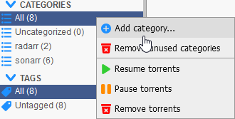
</div>

<div style="text-align: center">
    
    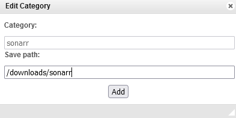
</div>

**[`^        retour au sommaire        ^`](#table-of-contents)**

---

## **Radarr**

### **Gestion des Médias**

1. Ouvrez l'interface Web et allez dans **Paramètres** > **Gestion des Médias**.
2. Cliquez sur **Ajouter un dossier racine**, ajoutez le chemin `/COMMON_PATH/radarr/movies` et cliquez sur **OK**.
3. Cliquez sur **Afficher les options avancées** en haut, faites défiler jusqu'à **Importation**, et assurez-vous que **Utiliser des liens physiques au lieu de copier** est activé.

<div style="text-align: center">
    
</div>

### **Clients de Téléchargement**

1. Dans l'interface Web, allez dans **Paramètres** > **Clients de Téléchargement**.
2. Cliquez sur **+** sous **Clients de Téléchargement**, puis sélectionnez **qBittorrent** dans la fenêtre **Ajouter un client de téléchargement**.
3. Remplissez les champs comme suit :
   - **Nom** : `qBittorrent` (ou un autre nom de votre choix)
   - **Hôte** : `qbittorrent`
   - **Nom d'utilisateur** : `admin`
   - **Mot de passe** : `adminadmin` (modifiez-le si vous l'avez changé dans qBittorrent)
   - **Catégorie** : `radarr` (cela doit correspondre à la catégorie définie dans qBittorrent)
4. Cliquez sur **Tester**. Si vous voyez une coche, cela signifie que la connexion fonctionne ; sinon, il y a une erreur.
5. Cliquez sur **Sauvegarder**.

<div style="text-align: center">
    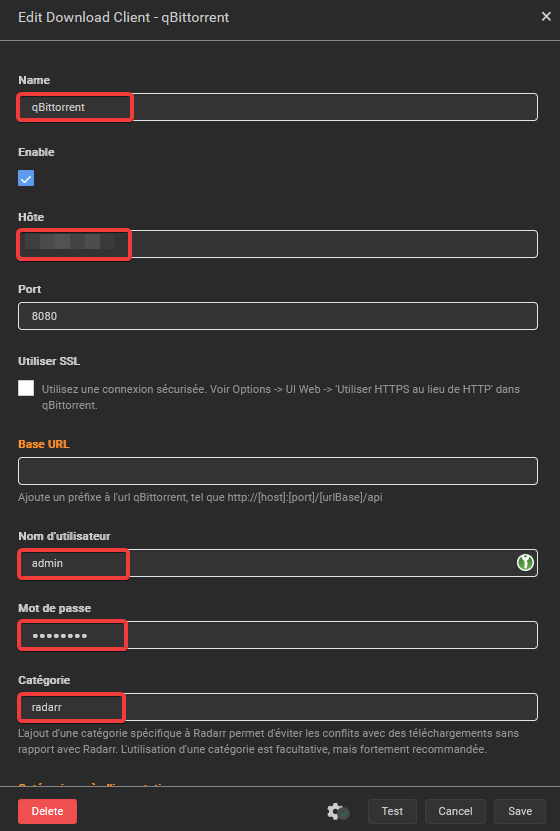
</div>

### **Indexer Jackett (Optionnelle)**

1. Dans l'interface Web, allez dans **Paramètres** > **Indexeurs**.
2. Cliquez sur **+** sous **Ajouter un Indexeur**, puis sélectionnez **Torznab**.
3. Remplissez les champs comme suit :
   - **Nom** : `Torznab` (ou un autre nom de votre choix)
   - **URL** : `http://Jackett:9117/api/v2.0/indexers/YOUR_INDEXERS/results/torznab/`
   - **Clé API** : Trouvez la clé API dans le menu d'accueil en haut à droite.
4. Cliquez sur **Tester**. Si vous voyez une coche, cela signifie que la connexion fonctionne ; sinon, il y a une erreur.
5. Cliquez sur **Sauvegarder**.

<div style="text-align: center">
    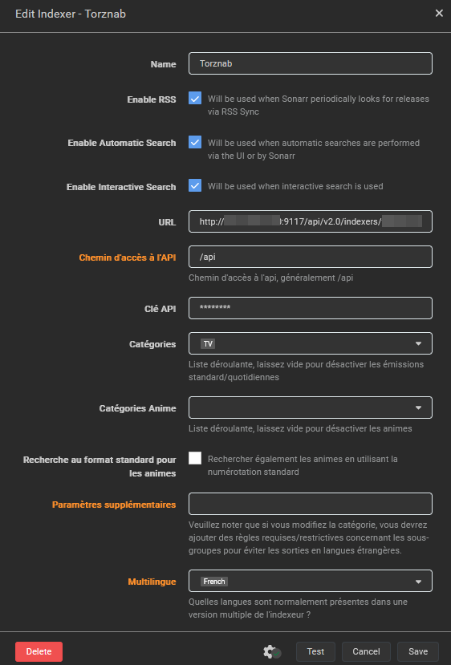
</div>

**[`^        retour au sommaire        ^`](#table-of-contents)**

---

## **Sonarr**

### **Gestion des Médias**

1. Ouvrez l'interface Web et allez dans **Paramètres** > **Gestion des Médias**.
2. Cliquez sur **Ajouter un dossier racine**, ajoutez le chemin `/COMMON_PATH/sonarr/tv`, puis cliquez sur **OK**.
3. Cliquez sur **Afficher les options avancées**, faites défiler jusqu'à **Importation**, et activez **Utiliser des liens physiques au lieu de copier**.

<div style="text-align: center">
    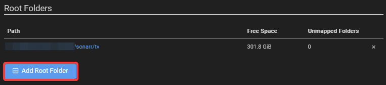
</div>

### **Clients de Téléchargement**

1. Dans l'interface Web, allez dans **Paramètres** > **Clients de Téléchargement**.
2. Cliquez sur **+** sous **Clients de Téléchargement**, puis sélectionnez **qBittorrent**.
3. Remplissez les champs comme suit :
   - **Nom** : `qBittorrent` (ou un autre nom de votre choix)
   - **Hôte** : `qbittorrent`
   - **Nom d'utilisateur** : `admin`
   - **Mot de passe** : `adminadmin` (modifiez-le si vous l'avez changé dans qBittorrent)
   - **Catégorie** : `sonarr` (cela doit correspondre à la catégorie définie dans qBittorrent)
4. Cliquez sur **Tester**. Si vous voyez une coche, cela signifie que la connexion fonctionne.
5. Cliquez sur **Sauvegarder**.

<div style="text-align: center">
    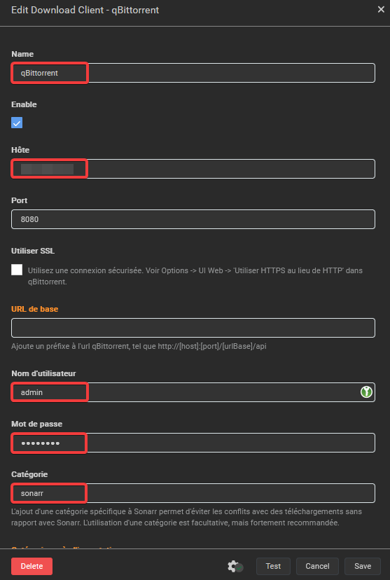
</div>

### **Indexer Jackett (Optionnelle)**

1. Dans l'interface Web, allez dans **Paramètres** > **Indexeurs**.
2. Cliquez sur **+** sous **Ajouter un Indexeur**, puis sélectionnez **Torznab**.
3. Remplissez les champs comme suit :
   - **Nom** : `Torznab` (ou un autre nom de votre choix)
   - **URL** : `http://Jackett:9117/api/v2.0/indexers/YOUR_INDEXERS/results/torznab/`
   - **Clé API** : Trouvez la clé API dans le menu d'accueil en haut à droite.
4. Cliquez sur **Tester**. Si vous voyez une coche, cela signifie que la connexion fonctionne ; sinon, il y a une erreur.
5. Cliquez sur **Sauvegarder**.

<div style="text-align: center">
    
</div>

**[`^        retour au sommaire        ^`](#table-of-contents)**

---

## **Prowlarr**

### **Configurer les Indexeurs de Torrents**

1. Ouvrez l'interface Web et allez dans **Indexeurs** > **Ajouter un Nouvel Indexeur**.
2. Sélectionnez **1337x** (ou un autre tracker de votre choix).
   - Vous pouvez modifier les paramètres selon vos préférences, mais les valeurs par défaut fonctionnent généralement bien.
   - Le tri par **Seeders** peut être utile pour des téléchargements plus rapides.
3. Cliquez sur **Tester**. Si vous voyez une coche, la connexion fonctionne ; sinon, il y a une erreur.
4. Cliquez sur **Sauvegarder**.

### **Configurer FlareSolverr**

1. Allez dans **Paramètres** et cliquez sur **+** sous **Indexer**.
2. Sélectionnez **FlareSolverr** et remplissez les informations comme suit :
   - **Nom** : `FlareSolverr`
   - **Tags** : `flaresolverr`
   - **Hôte** : `http://flaresolverr:8191/`
3. Cliquez sur **Tester** pour vérifier la connexion.
4. Cliquez sur **Sauvegarder**.

<div style="text-align: center">
    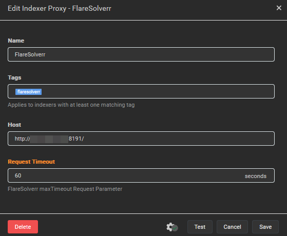
</div>

### **Configurer Radarr**

1. Allez dans **Paramètres** et cliquez sur **Apps**.
2. Sélectionnez **Radarr** et remplissez les informations comme suit :
   - **Niveau de synchronisation** : `Synchronisation complète`
   - **Serveur Prowlarr** : `http://prowlarr:9696`
   - **Serveur Radarr** : `http://radarr:7878`
   - **Clé API** : Trouvez la clé API dans l'interface de Radarr sous **Paramètres** > **Général** > **Clé API**.
3. Cliquez sur **Tester** pour vérifier la connexion.
4. Cliquez sur **Sauvegarder**.

<div style="text-align: center">
    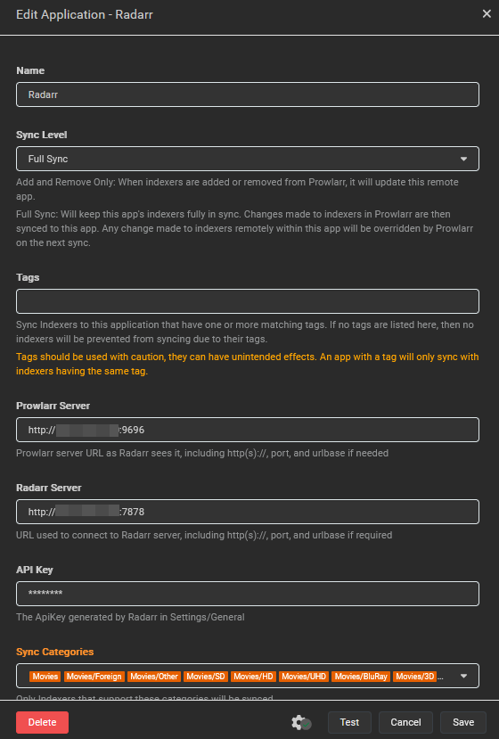
</div>

### **Configurer Sonarr**

1. Allez dans **Paramètres** et cliquez sur **Apps**.
2. Sélectionnez **Sonarr** et remplissez les informations comme suit :
   - **Niveau de synchronisation** : `Synchronisation complète`
   - **Serveur Prowlarr** : `http://prowlarr:9696`
   - **Serveur Sonarr** : `http://sonarr:8989`
   - **Clé API** : Trouvez la clé API dans l'interface de Sonarr sous **Paramètres** > **Général** > **Clé API**.
3. Cliquez sur **Tester** pour vérifier la connexion.
4. Cliquez sur **Sauvegarder**.

<div style="text-align: center">
    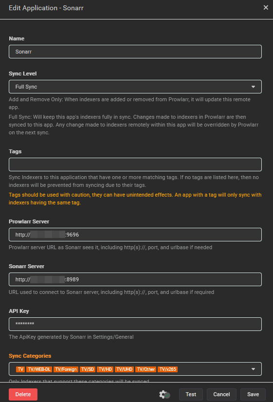
</div>

**[`^        retour au sommaire        ^`](#table-of-contents)**

---

## **Jellyfin**

### **Configuration Initiale**

1. Ouvrez l'interface Web en allant dans l'onglet **DOCKER**, cliquez sur l'icône de l'application Jellyfin et sélectionnez **WebUI**.
2. Sélectionnez une langue d'affichage préférée (ou utilisez l'anglais par défaut). Cliquez sur **Suivant** ➝.
3. Créez un compte administrateur, remplissez les informations d'identification selon vos préférences et cliquez sur **Suivant** ➝.
4. Cliquez sur **Ajouter une bibliothèque multimédia** et remplissez les informations suivantes :
   - **Type de contenu** : Films
   - **Dossiers** : `/COMMON_PATH/radarr/movies`
   - Configurez le reste comme bon vous semble ; les paramètres par défaut conviennent généralement.
5. Cliquez sur **OK**.
6. Cliquez de nouveau sur **Ajouter une bibliothèque multimédia** et remplissez les informations suivantes :
   - **Type de contenu** : Séries
   - **Dossiers** : `/COMMON_PATH/sonarr/tv`
   - Configurez le reste comme bon vous semble ; les paramètres par défaut conviennent généralement.
7. Cliquez sur **OK**.
8. Cliquez sur **Suivant** ➝.
9. Configurez la **Langue de Métadonnées Préférée** (ou utilisez la langue par défaut) et cliquez sur **Suivant** ➝.
10. Dans **Configurer l'accès à distance**, laissez **Autoriser les connexions distantes à ce serveur** coché et **Activer le mappage automatique de port** décoché.
11. Cliquez sur **Suivant** ➝, puis cliquez sur **Terminer**.
12. Connectez-vous avec votre compte administrateur.

Une fois connecté, si vous avez déjà du contenu dans vos dossiers `/COMMON_PATH/*`, il devrait commencer à apparaître dans Jellyfin. Sinon, le contenu sera ajouté au fur et à mesure que les dossiers se remplissent.

### **Ajouter des utilisateurs à Jellyfin**

Si vous souhaitez que d'autres utilisateurs aient accès à votre serveur Jellyfin, vous pouvez créer des comptes utilisateurs supplémentaires. Cette étape est optionnelle si vous êtes le seul utilisateur.

1. Ouvrez le menu à gauche en cliquant sur les trois lignes horizontales (menu hamburger) dans le coin supérieur gauche.
2. Sélectionnez **Utilisateurs** et cliquez sur le bouton **+** à gauche pour ajouter un nouvel utilisateur.
3. Remplissez les informations suivantes pour le nouvel utilisateur :
   - **Nom** : `<nom_utilisateur>`
   - **Mot de passe** : `<mot_de_passe>`
   - Sous **Accès à la bibliothèque**, cochez les cases des bibliothèques (Films, Séries TV, etc.) auxquelles vous voulez que l'utilisateur ait accès.
4. Cliquez sur **Sauvegarder** pour créer l'utilisateur.
5. Répétez ce processus pour tous les utilisateurs que vous souhaitez ajouter au serveur.

**[`^        retour au sommaire        ^`](#table-of-contents)**

---

## **Jellyseerr**

### **Connexion / Configuration**

1. Ouvrez l'interface Web et, dans l'écran **Bienvenue sur Jellyseerr**, sélectionnez **Utiliser votre compte Jellyfin**.
2. Remplissez les informations comme suit :
   - **URL Jellyfin** : `http://jellyfin:8096/`
   - **Adresse Email** : `<votre adresse email>`
   - **Nom d'utilisateur** : `<votre nom d'utilisateur Jellyfin>`
   - **Mot de passe** : `<votre mot de passe Jellyfin>`
3. Sélectionnez **Se connecter**.
4. Allez dans **Synchroniser les bibliothèques** sous **Bibliothèques Jellyfin**, sélectionnez vos bibliothèques Jellyfin, puis cliquez sur **Continuer**.

### **Intégration avec Radarr**

1. Allez dans **Paramètres Radarr**, puis cliquez sur **Ajouter un serveur Radarr**.
2. Remplissez les informations comme suit :
   - **Serveur par défaut** : Cochez cette case
   - **Nom du serveur** : `Radarr`
   - **Nom ou adresse IP** : `http://radarr`
   - **Port** : `7878`
   - **Clé API** : Trouvez la clé API dans l'interface Radarr sous **Paramètres** > **Général** > **Clé API**.
3. Cliquez sur **Tester** pour vérifier la connexion.
4. Cliquez sur **Sauvegarder les modifications**.

### **Intégration avec Sonarr**

1. Allez dans **Paramètres Sonarr**, puis cliquez sur **Ajouter un serveur Sonarr**.
2. Remplissez les informations comme suit :
   - **Serveur par défaut** : Cochez cette case
   - **Nom du serveur** : `Sonarr`
   - **Nom ou adresse IP** : `http://sonarr`
   - **Port** : `8989`
   - **Clé API** : Trouvez la clé API dans l'interface Sonarr sous **Paramètres** > **Général** > **Clé API**.
3. Cliquez sur **Tester** pour vérifier la connexion.
4. Cliquez sur **Sauvegarder les modifications**.

**[`^        retour au sommaire        ^`](#table-of-contents)**

---

# **Mise à jour des applications**

Pour mettre à jour les applications, vous devez d'abord arrêter les conteneurs en cours d'exécution et supprimer les images Docker existantes. Vous pouvez utiliser les commandes suivantes pour effectuer ces opérations :

```bash
docker-compose down
docker image prune -a
```

Ensuite, vous pouvez exécuter `docker-compose up -d` pour redémarrer les conteneurs avec les dernières versions des applications.

**[`^        retour au sommaire        ^`](#table-of-contents)**

# **Avertissement**

Ce code est fourni à titre informatif uniquement et ne doit pas être utilisé pour des activités illégales. Je ne suis pas responsable des actions effectuées par les utilisateurs de ce code. Ce code est à des fins informatives, et si les gens souhaitent l'utiliser, ils doivent consulter les lois de leurs pays.
