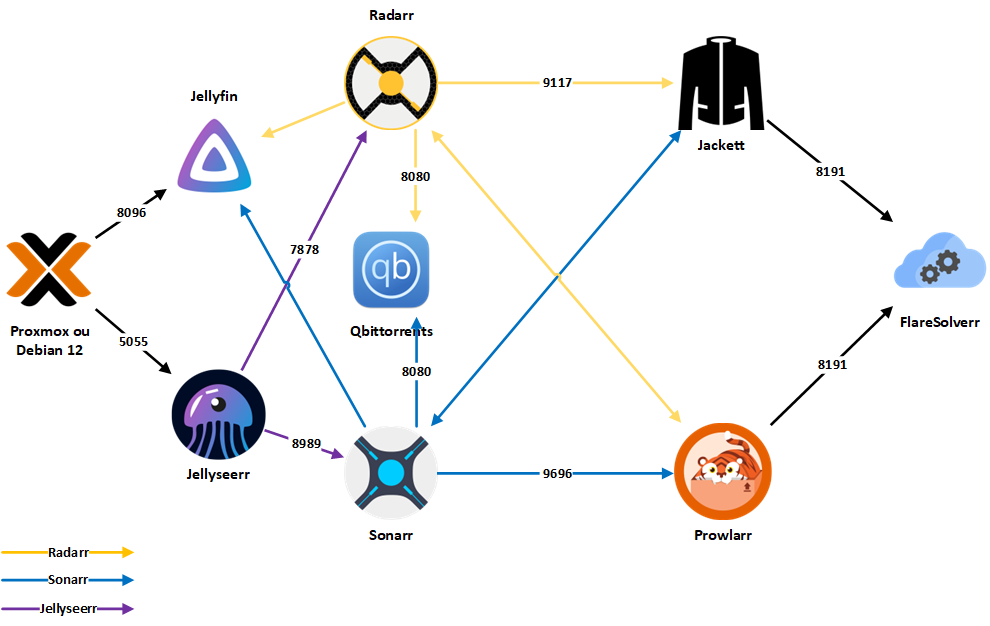

# All-jellyfin-media-server

<div style="text-align: center">
    
</div>

Bienvenue sur le Repository All-jellyfin-media-server ! Ce Repository contient tout ce dont vous avez besoin pour créer votre propre serveur multimédia Jellyfin avec Sonarr, Radarr, jellyseerr, Prowlarr, Jackett, qBittorrent et Gluetun (Nord VPN) dans un docker compose. Nous allons appeler la compilation de tous les conteneurs comme serveur ISIRR pour que ca soit plus simple.

    

**Acceder au repository en [Anglais](https://github.com/Morzomb/All-jellyfin-media-server/tree/Main)**

## Table de matière :

- [À quoi sert ce Serveur](#À-quoi-sert-ce-Serveur)
  - [Docker](#docker)
  - [Jellyfin](#jellyfin)
  - [Jellyseerr](#jellyseerr)
  - [Sonarr](#sonarr)
  - [Radarr](#radarr)
  - [Jackett](#jackett)
  - [Flaresolverr](#flaresolverr)
  - [QBittorrent](#qbittorrent)
  - [Gluetun avec Nord VPN](#gluetun-nordvpn)
- [Prérequis](#prérequis)
  - [Utilisation de Docker](#docker)
  - [NVidia](#nvidia)
- [Disclaimer](#Disclaimer)
- Un Problème ?
  - [Creer un ticket](https://github.com/Morzomb/All-jellyfin-media-server/issues)


## À quoi sert ISIRR ?

ISIRR vous permet de créer votre propre serveur multimédia Jellyfin avec tous les outils nécessaires pour gérer vos films, séries TV, musiques et livres électroniques. Il comprend également des outils pour automatiser le téléchargement de nouveaux contenus et pour protéger votre vie privée en utilisant un VPN.

ISIRR utilise Docker et Docker Compose pour déployer les services. Les fichiers Docker Compose se trouvent dans les répertoires with-vpn et without-vpn.

Pour utiliser Docker Compose, assurez-vous que Docker est installé sur votre système.

---

### Jellyfin 

[Jellyfin](https://jellyfin.org/) est un logiciel de serveur multimédia open source qui vous permet de diffuser vos films, séries TV, musiques et livres électroniques sur tous vos appareils. Il est compatible avec de nombreux types de fichiers multimédias et prend en charge la diffusion en continu sur de nombreux appareils.

<div style="text-align: center">
    
</div>

### Jellyseerr

Jellyseerr is an open-source application that allows you to automate the management of your Jellyfin media server. It works by monitoring your Jellyfin library and automatically searching for and downloading new content based on your preferences. Jellyseerr supports integration with various other tools, such as Sonarr and Radarr, to provide a seamless experience for managing your media collection.

<div style="text-align: center"> 
     
</div>

### Sonarr :

[Sonarr](https://sonarr.tv/) est un logiciel de gestion de séries TV qui vous permet de rechercher, télécharger et gérer automatiquement vos séries TV préférées. Il fonctionne avec de nombreux types de trackers et de clients torrent et prend en charge la recherche automatique de sous-titres.


<div style="text-align: center">
    
</div>

### Radarr :

[Radarr](https://radarr.video/) est un logiciel de gestion de films qui vous permet de rechercher, télécharger et gérer automatiquement vos films préférés. Il fonctionne avec de nombreux types de trackers et de clients torrent et prend en charge la recherche automatique de sous-titres.

<div style="text-align: center">
    
</div>

### Jackett :

[Jackett](https://github.com/Jackett/Jackett) est un logiciel de proxy pour les trackers torrent qui vous permet de rechercher des fichiers torrent sur de nombreux trackers à partir d'un seul endroit. Il fonctionne avec de nombreux types de clients torrent et prend en charge l'authentification et la recherche avancée.

<div style="text-align: center">
    
</div>

### Flaresolverr

[Flaresolverr](https://github.com/FlareSolverr/FlareSolverr) est un logiciel open source qui vous permet de contourner les restrictions de streaming sur les sites de partage de vidéos. Il fonctionne en résolvant les liens de streaming et en contournant les blocages géographiques et les restrictions de lecture.

<div style="text-align: center">
    
</div>

### Prowlarr :

[Prowlarr](https://github.com/Prowlarr/Prowlarr) est un logiciel de gestion de téléchargements qui vous permet de rechercher et de télécharger automatiquement des fichiers à partir de nombreux types de sources, y compris les trackers torrent, les newsgroups et les sites de téléchargement direct.

<div style="text-align: center">
    
</div>

### qBittorrent

[qBittorrent](https://www.qbittorrent.org/) est un client BitTorrent open source qui vous permet de télécharger des fichiers torrent. Il est léger, facile à utiliser et prend en charge de nombreuses fonctionnalités avancées telles que la recherche intégrée de torrents, le chiffrement, la création de torrents et la prise en charge de trackers privés.

<div style="text-align: center">
    
</div>

### Gluetun (NordVPN)

[Gluetun](https://github.com/qdm12/gluetun) est un client VPN open source qui vous permet de vous connecter aux serveurs NordVPN. Il est facile à utiliser et prend en charge de nombreuses fonctionnalités avancées telles que la redirection de port, la protection contre les fuites DNS et la prise en charge de plusieurs protocoles VPN.

<div style="text-align: center">
   
</div>

---

# Prérequis 

## Docker

Pour installer Docker sur votre système, vous pouvez utiliser le script suivant :
```bash
curl -fsSL https://get.docker.com -o get-docker.sh
sh get-docker.sh
```

### Utilisation de Docker Compose

Pour utiliser Docker Compose avec ce référentiel, vous devez d'abord choisir si vous souhaitez utiliser la version avec VPN ou sans VPN. Ensuite, accédez au répertoire correspondant (with-vpn ou without-vpn) et exécutez la commande suivante :

```bash
docker-compose up -d
```
Pour éteindre la stack :

```bash
docker-compose down
```

## NVIDIA

Pour ma part mon serveur dispose d'un carte Graphique Nvidia GForce 1060. L'os installer est un promox 8.1.10 basée sur debian 12.

1. Your `/etc/apt/sources.list` should look like this:

```bash
deb http://ftp.debian.org/debian bookworm main contrib
deb http://ftp.debian.org/debian bookworm-updates main contrib

# Proxmox VE pve-no-subscription repository provided by proxmox.com,
# NOT recommended for production use
deb http://download.proxmox.com/debian/pve bookworm pve-no-subscription

# security updates
deb http://security.debian.org/debian-security bookworm-security main contrib

# Debian Bookworm
# Ajouter cette ligne 
deb http://deb.debian.org/debian/ bookworm main contrib non-free non-free-firmware
```

2. Mise à jour des dépots :
```bash
apt update
```
3. Installation des mises à jours :
```bash
apt upgrade
```
4. Installation des drivers NVidia : 

Seulement pour un environement promox :

```bash
apt install pve-headers
```
Ensuite :
```bash
apt install libnvidia-cfg1 nvidia-kernel-source nvidia-kernel-common nvidia-driver 
```

6. Reboot

7. `nvidia-smi` devrai afficher ca :

```
+-----------------------------------------------------------------------------+
| NVIDIA-SMI 525.147.05   Driver Version: 525.147.05   CUDA Version: 12.0     |
|-------------------------------+----------------------+----------------------+
| GPU  Name        Persistence-M| Bus-Id        Disp.A | Volatile Uncorr. ECC |
| Fan  Temp  Perf  Pwr:Usage/Cap|         Memory-Usage | GPU-Util  Compute M. |
|                               |                      |               MIG M. |
|===============================+======================+======================|
|   0  NVIDIA GeForce ...  On   | 00000000:01:00.0 Off |                  N/A |
| N/A   47C    P8     9W /  78W |      1MiB /  3072MiB |      0%      Default |
|                               |                      |                  N/A |
+-------------------------------+----------------------+----------------------+

+-----------------------------------------------------------------------------+
| Processes:                                                                  |
|  GPU   GI   CI        PID   Type   Process name                  GPU Memory |
|        ID   ID                                                   Usage      |
|=============================================================================|
|  No running processes found                                                 |
+-----------------------------------------------------------------------------+
```

Il peut y avoir des erreurs lors de l'installation il est préférable d'utiliser  nvidia-patch :

```
git clone https://github.com/keylase/nvidia-patch.git

cd nvidia-patch
./patch.sh
```

# Disclaimer

Ce code est fourni à des fins informatives uniquement et ne doit pas être utilisé à des fins illégales. Je ne suis pas responsable des actions effectuées par les utilisateurs de ce code. Ce code a pour but informatif et si les personnes souhaitent l'utiliser, elles doivent se renseigner auprès des lois de leurs pays.
