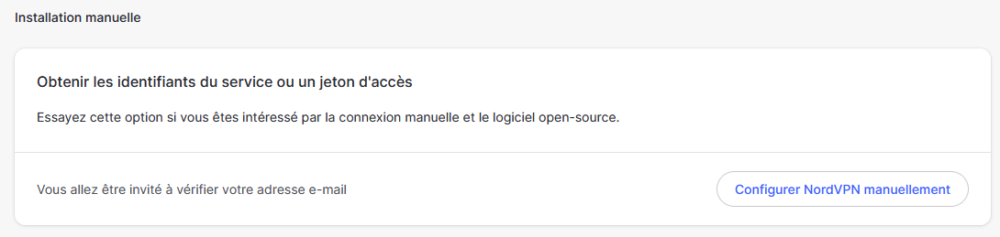
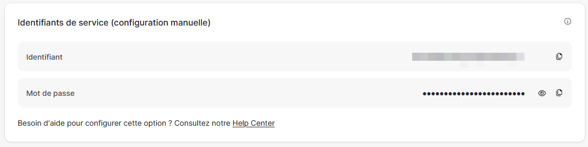

# All-jellyfin-media-server

<div style="text-align: center">
    
</div>

Welcome to the All-jellyfin-media-server Repository! This repository contains everything you need to create your own Jellyfin media server with Sonarr, Radarr, Jellyseerr, Prowlarr, Jackett, qBittorrent, and Gluetun (Nord VPN) in a Docker Compose setup. We'll refer to the compilation of all containers as **Isyrr** to keep it simple.


 

[](https://github.com/Morzomb/All-jellyfin-media-server/commits/master)


**Acceder au repository en [Français](https://github.com/Morzomb/All-jellyfin-media-server/tree/fr)**

## Table of contents :

- [What is Isyrr for?](#what-is-isyrr-for)
  - [Jellyfin](#jellyfin)
  - [Jellyseerr](#jellyseerr)
  - [Sonarr](#sonarr)
  - [Radarr](#radarr)
  - [Jackett](#jackett)
  - [Flaresolverr](#flaresolverr)
  - [QBittorrent](#qbittorrent)
  - [Gluetun with Nord VPN](#gluetun-nordvpn)
- [Prerequisites](#prerequisites)
  - [Using Docker](#docker)
  - [NVidia](#nvidia)
  - [NordVPN](#vpn)
- [Installation](#installation)
  - [Basic Installation](#basic-installation)
  - [Installation with NVidia](#installation-with-nvidia-only)
  - [Installation with VPN](#installation-with-vpn-only)
  - [Installation with NVidia & VPN](#installation-with-nvidia-and-vpn)
- [Accessing Applications](#accessing-applications)
  - [Updating Applications](#updating-applications)
- [Disclaimer](#Disclaimer)
- [Create issues](https://github.com/Morzomb/All-jellyfin-media-server/issues)

## What is Isyrr for?

This repository allows you to create your own Jellyfin media server with all the necessary tools to manage your movies, TV shows, music, and eBooks. It also includes tools to automate the downloading of new content and to protect your privacy using a VPN.

Isyrr uses Docker and Docker Compose to deploy the services. Docker Compose files can be found in the directories with-vpn and without-vpn.

To use Docker Compose, make sure Docker is installed on your system.

---

### Jellyfin 

[Jellyfin](https://jellyfin.org/) is an open-source media server software that allows you to stream your movies, TV shows, music, and eBooks to all your devices. It is compatible with many types of media files and supports streaming to numerous devices.

<div style="text-align: center">
    
</div>

### Jellyseerr

[Jellyseerr](https://github.com/Fallenbagel/jellyseerr) is an open-source application that allows you to automate the management of your Jellyfin media server. It works by monitoring your Jellyfin library and automatically searching for and downloading new content based on your preferences. Jellyseerr supports integration with various other tools, such as Sonarr and Radarr, to provide a seamless experience for managing your media collection.

<div style="text-align: center"> 
     
</div>

### Sonarr :

[Sonarr](https://sonarr.tv/) is TV show management software that allows you to search, download, and manage your favorite TV shows automatically. It works with many types of trackers and torrent clients and supports automatic subtitle downloading.


<div style="text-align: center">
    
</div>

### Radarr :

[Radarr](https://radarr.video/) is movie management software that allows you to search, download, and manage your favorite movies automatically. It works with many types of trackers and torrent clients and supports automatic subtitle downloading.

<div style="text-align: center">
    
</div>

### Jackett :

[Jackett](https://github.com/Jackett/Jackett) is a proxy software for torrent trackers that allows you to search for torrent files on many trackers from one place. It works with many types of torrent clients and supports authentication and advanced searching.

<div style="text-align: center">
    
</div>

### Flaresolverr

[Flaresolverr](https://github.com/FlareSolverr/FlareSolverr) is open-source software that allows you to bypass streaming restrictions on video-sharing sites. It works by resolving streaming links and bypassing geographical blocks and playback restrictions.

<div style="text-align: center">
    
</div>

### Prowlarr :

[Prowlarr](https://github.com/Prowlarr/Prowlarr) is download management software that allows you to search for and automatically download files from many types of sources, including torrent trackers, newsgroups, and direct download sites.

<div style="text-align: center">
    
</div>

### qBittorrent

[qBittorrent](https://www.qbittorrent.org/) is open-source BitTorrent client software that allows you to download torrent files. It is lightweight, easy to use, and supports many advanced features such as built-in torrent search, encryption, torrent creation, and support for private trackers.

<div style="text-align: center">
    
</div>

### Gluetun (NordVPN)

[Gluetun](https://github.com/qdm12/gluetun) is open-source VPN client software that allows you to connect to NordVPN servers. It is easy to use and supports many advanced features such as port forwarding, DNS leak protection, and support for multiple VPN protocols.

<div style="text-align: center">
   
</div>

---

# Prerequisites 

## Docker

To install Docker on your system, you can use the following script:
```bash
curl -fsSL https://get.docker.com -o get-docker.sh
sh get-docker.sh
```

### Using Docker Compose

To use Docker Compose with this repository, you first need to choose whether you want to use the version with VPN or without VPN. Then, navigate to the corresponding directory (with-vpn or without-vpn) and run the following command :

```bash
docker-compose up -d
```
To shut down the stack :

```bash
docker-compose down
```

## NVIDIA

For my server, it has an NVIDIA GeForce 1060 Graphics Card. The installed OS is Proxmox 8.1.10 based on Debian 12. If you need to check [compatibility.](https://developer.nvidia.com/video-encode-and-decode-gpu-support-matrix-new)

1. Your `/etc/apt/sources.list` should look like this:

```bash
deb http://ftp.debian.org/debian bookworm main contrib
deb http://ftp.debian.org/debian bookworm-updates main contrib

# Proxmox VE pve-no-subscription repository provided by proxmox.com,
# NOT recommended for production use
deb http://download.proxmox.com/debian/pve bookworm pve-no-subscription

# security updates
deb http://security.debian.org/debian-security bookworm-security main contrib

# Debian Bookworm
### Add this line
deb http://deb.debian.org/debian/ bookworm main contrib non-free non-free-firmware
```
And : 

```bash
curl -fsSL https://nvidia.github.io/libnvidia-container/gpgkey | gpg --dearmor -o /usr/share/keyrings/nvidia-container-toolkit-keyring.gpg \
  && curl -s -L https://nvidia.github.io/libnvidia-container/stable/deb/nvidia-container-toolkit.list | \
    sed 's#deb https://#deb [signed-by=/usr/share/keyrings/nvidia-container-toolkit-keyring.gpg] https://#g' | \
    tee /etc/apt/sources.list.d/nvidia-container-toolkit.list
```

2. Update repositories :
```bash
apt update
```
3. Install updates :
```bash
apt upgrade
```
4. Install NVIDIA drivers :

Only for Proxmox environment :

```bash
apt install pve-headers
```
Then :

```bash
apt install libnvidia-cfg1 nvidia-kernel-source nvidia-kernel-common nvidia-driver nvidia-container-toolkit

nvidia-ctk runtime configure --runtime=docker
```

5. Reboot

6. Then enter **nvidia-smi** which should display:

```
root@pve:~#nvidia-smi
+-----------------------------------------------------------------------------+
| NVIDIA-SMI 525.147.05   Driver Version: 525.147.05   CUDA Version: 12.0     |
|-------------------------------+----------------------+----------------------+
| GPU  Name        Persistence-M| Bus-Id        Disp.A | Volatile Uncorr. ECC |
| Fan  Temp  Perf  Pwr:Usage/Cap|         Memory-Usage | GPU-Util  Compute M. |
|                               |                      |               MIG M. |
|===============================+======================+======================|
|   0  NVIDIA GeForce ...  On   | 00000000:01:00.0 Off |                  N/A |
| N/A   47C    P8     9W /  78W |      1MiB /  3072MiB |      0%      Default |
|                               |                      |                  N/A |
+-------------------------------+----------------------+----------------------+

+-----------------------------------------------------------------------------+
| Processes:                                                                  |
|  GPU   GI   CI        PID   Type   Process name                  GPU Memory |
|        ID   ID                                                   Usage      |
|=============================================================================|
|  No running processes found                                                 |
+-----------------------------------------------------------------------------+
```

There might be errors during installation; it's preferable to use nvidia-patch :

```bash
git clone https://github.com/keylase/nvidia-patch.git

cd nvidia-patch
./patch.sh
```

## VPN 

Now we will see how to set up the VPN (Nord VPN). First, you need to connect to the Nord VPN website.

1. Go to Nord VPN services :

<div style="text-align: center">
    
</div>

2. Select manual configuration of NordVPN :

<div style="text-align: center">
    
</div>

3. You can now take your login and password for the gluetun container :

<div style="text-align: center">
    
</div>

# Installation

First, clone the repository :

```bash
git clone https://github.com/Morzomb/All-jellyfin-media-server.git
cd All-jellyfin-media-server/
```

## Basic Installation :

Classic installation without `VPN` and without `NVidia` :

```yaml
---
version: "3.3"
services:
  qbittorrent:
    image: lscr.io/linuxserver/qbittorrent:latest
    container_name: qbittorrent
    environment:
      - WEBUI_PORT=8080
      - PUID=0
      - PGID=0
      - TZ=${TZ}
      - DOCKER_MODS=ghcr.io/gabe565/linuxserver-mod-vuetorrent
    volumes:
      - ${COMMON_PATH}:${COMMON_PATH}
      - ${COMMON_PATH}/configs/qbittorrent:/config
      - ${COMMON_PATH}/qbittorrent/downloads:/downloads
    ports:
      - 8080:8080
      - 6881:6881
      - 6881:6881/udp
    restart: unless-stopped
  flaresolverr:
    image: ghcr.io/flaresolverr/flaresolverr:latest
    container_name: flaresolverr
    environment:
      - LOG_LEVEL=${LOG_LEVEL:-info}
      - LOG_HTML=${LOG_HTML:-false}
      - CAPTCHA_SOLVER=${CAPTCHA_SOLVER:-none}
      - TZ=${TZ}
    ports:
      - 8191:8191
    restart: unless-stopped
  prowlarr:
    image: lscr.io/linuxserver/prowlarr:latest
    container_name: prowlarr
    environment:
      - PUID=0
      - PGID=0
      - TZ=${TZ}
    volumes:
      - ${COMMON_PATH}/configs/prowlarr:/config
    ports:
      - 9696:9696
    restart: unless-stopped
  jackett:
    image: lscr.io/linuxserver/jackett:latest
    container_name: jackett
    environment:
      - PUID=0
      - PGID=0
      - TZ=${TZ}
    volumes:
      - ${COMMON_PATH}/configs/jackett:/config
    ports:
      - 9117:9117
    restart: unless-stopped
  sonarr:
    image: lscr.io/linuxserver/sonarr:latest
    container_name: sonarr
    environment:
      - PUID=0
      - PGID=0
      - TZ=${TZ}
    volumes:
      - ${COMMON_PATH}:${COMMON_PATH}
      - ${COMMON_PATH}/configs/sonarr:/config
      - ${COMMON_PATH}/sonarr/tv:/tv
      - ${COMMON_PATH}/qbittorrent/downloads:/downloads
    ports:
      - 8989:8989
    restart: unless-stopped
  radarr:
    image: lscr.io/linuxserver/radarr:latest
    container_name: radarr
    environment:
      - PUID=0
      - PGID=0
      - TZ=${TZ}
    volumes:
      - ${COMMON_PATH}:${COMMON_PATH}
      - ${COMMON_PATH}/configs/radarr:/config
      - ${COMMON_PATH}/radarr/movies:/movies
      - ${COMMON_PATH}/qbittorrent/downloads:/downloads
    ports:
      - 7878:7878
    restart: unless-stopped
  jellyfin:
    image: lscr.io/linuxserver/jellyfin:latest
    container_name: jellyfin
    environment:
      - PUID=0
      - PGID=0
      - TZ=${TZ}
      - NVIDIA_VISIBLE_DEVICES=all
    ports:
      - 8096:8096
      - 8920:8920
      - 7359:7359/udp
      - 1900:1900/udp
    volumes:
      - ${COMMON_PATH}:${COMMON_PATH}
      - ${COMMON_PATH}/configs/jellyfin:/config
      - ${COMMON_PATH}/jellyfin/cache:/cache
      - ${COMMON_PATH}/sonarr/tv:/data/tvshows
      - ${COMMON_PATH}/radarr/movies:/data/movies
      - ${COMMON_PATH}/qbittorrent/downloads:/data/media_downloads
    restart: unless-stopped
  jellyseerr:
    image: fallenbagel/jellyseerr:latest
    container_name: jellyseerr
    environment:
      - LOG_LEVEL=debug
      - TZ=${TZ}
    ports:
      - 5055:5055
    volumes:
      - ${COMMON_PATH}/configs/jellyseerr:/app/config
    restart: unless-stopped
```

To launch the installation, simply run :

```bash
docker compose -f docker-compose.yaml up -d
```

## Installation with NVidia only :

Classic installation without `VPN` but with `NVidia`:

```yaml
---
version: "3.3"
services:
  qbittorrent:
    image: lscr.io/linuxserver/qbittorrent:latest
    container_name: qbittorrent
    environment:
      - WEBUI_PORT=8080
      - PUID=0
      - PGID=0
      - TZ=${TZ}
      - DOCKER_MODS=ghcr.io/gabe565/linuxserver-mod-vuetorrent
    volumes:
      - ${COMMON_PATH}:${COMMON_PATH}
      - ${COMMON_PATH}/configs/qbittorrent:/config
      - ${COMMON_PATH}/qbittorrent/downloads:/downloads
    ports:
      - 8080:8080
      - 6881:6881
      - 6881:6881/udp
    restart: unless-stopped
  flaresolverr:
    image: ghcr.io/flaresolverr/flaresolverr:latest
    container_name: flaresolverr
    environment:
      - LOG_LEVEL=${LOG_LEVEL:-info}
      - LOG_HTML=${LOG_HTML:-false}
      - CAPTCHA_SOLVER=${CAPTCHA_SOLVER:-none}
      - TZ=${TZ}
    ports:
      - 8191:8191
    restart: unless-stopped
  prowlarr:
    image: lscr.io/linuxserver/prowlarr:latest
    container_name: prowlarr
    environment:
      - PUID=0
      - PGID=0
      - TZ=${TZ}
    volumes:
      - ${COMMON_PATH}/configs/prowlarr:/config
    ports:
      - 9696:9696
    restart: unless-stopped
  jackett:
    image: lscr.io/linuxserver/jackett:latest
    container_name: jackett
    environment:
      - PUID=0
      - PGID=0
      - TZ=${TZ}
    volumes:
      - ${COMMON_PATH}/configs/jackett:/config
    ports:
      - 9117:9117
    restart: unless-stopped
  sonarr:
    image: lscr.io/linuxserver/sonarr:latest
    container_name: sonarr
    environment:
      - PUID=0
      - PGID=0
      - TZ=${TZ}
    volumes:
      - ${COMMON_PATH}:${COMMON_PATH}
      - ${COMMON_PATH}/configs/sonarr:/config
      - ${COMMON_PATH}/sonarr/tv:/tv
      - ${COMMON_PATH}/qbittorrent/downloads:/downloads
    ports:
      - 8989:8989
    restart: unless-stopped
  radarr:
    image: lscr.io/linuxserver/radarr:latest
    container_name: radarr
    environment:
      - PUID=0
      - PGID=0
      - TZ=${TZ}
    volumes:
      - ${COMMON_PATH}:${COMMON_PATH}
      - ${COMMON_PATH}/configs/radarr:/config
      - ${COMMON_PATH}/radarr/movies:/movies
      - ${COMMON_PATH}/qbittorrent/downloads:/downloads
    ports:
      - 7878:7878
    restart: unless-stopped
  jellyfin:
    image: lscr.io/linuxserver/jellyfin:latest
    container_name: jellyfin
    environment:
      - PUID=0
      - PGID=0
      - TZ=${TZ}
      - NVIDIA_VISIBLE_DEVICES=all
    ports:
      - 8096:8096
      - 8920:8920
      - 7359:7359/udp
      - 1900:1900/udp
    volumes:
      - ${COMMON_PATH}:${COMMON_PATH}
      - ${COMMON_PATH}/configs/jellyfin:/config
      - ${COMMON_PATH}/jellyfin/cache:/cache
      - ${COMMON_PATH}/sonarr/tv:/data/tvshows
      - ${COMMON_PATH}/radarr/movies:/data/movies
      - ${COMMON_PATH}/qbittorrent/downloads:/data/media_downloads
    restart: unless-stopped
    deploy:
      resources:
        reservations:
          devices:
            - driver: nvidia
              count: 1
              capabilities:
                - gpu
  jellyseerr:
    image: fallenbagel/jellyseerr:latest
    container_name: jellyseerr
    environment:
      - LOG_LEVEL=debug
      - TZ=${TZ}
    ports:
      - 5055:5055
    volumes:
      - ${COMMON_PATH}/configs/jellyseerr:/app/config
    restart: unless-stopped
```

To launch the installation, simply run :

```bash
docker compose -f docker-compose-nvidia.yaml up -d
```

## Installation with VPN only :

Classic installation with `VPN` but without `NVidia`:

```yaml
---
version: "3.3"
services:
  nordvpn:
    container_name: GlueTun-VPN
    image: qmcgaw/gluetun
    cap_add:
      - NET_ADMIN
    ports:
      - 8080:8080
      - 51420:51420
      - 51420:51420/udp
    environment:
      - VPN_SERVICE_PROVIDER=nordvpn
      - OPENVPN_USER=${OPENVPN_USER}
      - OPENVPN_PASSWORD=${OPENVPN_PASSWORD}
      - SERVER_REGIONS=Belgium
      - VPN_TYPE=openvpn
    restart: always
  qbittorrent:
    image: lscr.io/linuxserver/qbittorrent:latest
    network_mode: service:nordvpn
    container_name: qbittorrent
    depends_on:
      - nordvpn
    environment:
      - WEBUI_PORT=8080
      - PUID=0
      - PGID=0
      - TZ=${TZ}
      - DOCKER_MODS=ghcr.io/gabe565/linuxserver-mod-vuetorrent
    volumes:
      - ${COMMON_PATH}:${COMMON_PATH}
      - ${COMMON_PATH}/configs/qbittorrent:/config
      - ${COMMON_PATH}/qbittorrent/downloads:/downloads
    restart: unless-stopped
  flaresolverr:
    image: ghcr.io/flaresolverr/flaresolverr:latest
    container_name: flaresolverr
    environment:
      - LOG_LEVEL=${LOG_LEVEL:-info}
      - LOG_HTML=${LOG_HTML:-false}
      - CAPTCHA_SOLVER=${CAPTCHA_SOLVER:-none}
      - TZ=${TZ}
    ports:
      - 8191:8191
    restart: unless-stopped
  prowlarr:
    image: lscr.io/linuxserver/prowlarr:latest
    container_name: prowlarr
    environment:
      - PUID=0
      - PGID=0
      - TZ=${TZ}
    volumes:
      - ${COMMON_PATH}/configs/prowlarr:/config
    ports:
      - 9696:9696
    restart: unless-stopped
  jackett:
    image: lscr.io/linuxserver/jackett:latest
    container_name: jackett
    environment:
      - PUID=0
      - PGID=0
      - TZ=${TZ}
    volumes:
      - ${COMMON_PATH}/configs/jackett:/config
    ports:
      - 9117:9117
    restart: unless-stopped
  sonarr:
    image: lscr.io/linuxserver/sonarr:latest
    container_name: sonarr
    environment:
      - PUID=0
      - PGID=0
      - TZ=${TZ}
    volumes:
      - ${COMMON_PATH}:${COMMON_PATH}
      - ${COMMON_PATH}/configs/sonarr:/config
      - ${COMMON_PATH}/sonarr/tv:/tv
      - ${COMMON_PATH}/qbittorrent/downloads:/downloads
    ports:
      - 8989:8989
    restart: unless-stopped
  radarr:
    image: lscr.io/linuxserver/radarr:latest
    container_name: radarr
    environment:
      - PUID=0
      - PGID=0
      - TZ=${TZ}
    volumes:
      - ${COMMON_PATH}:${COMMON_PATH}
      - ${COMMON_PATH}/configs/radarr:/config
      - ${COMMON_PATH}/radarr/movies:/movies
      - ${COMMON_PATH}/qbittorrent/downloads:/downloads
    ports:
      - 7878:7878
    restart: unless-stopped
  jellyfin:
    image: lscr.io/linuxserver/jellyfin:latest
    container_name: jellyfin
    environment:
      - PUID=0
      - PGID=0
      - TZ=${TZ}
      - NVIDIA_VISIBLE_DEVICES=all
    ports:
      - 8096:8096
      - 8920:8920
      - 7359:7359/udp
      - 1900:1900/udp
    volumes:
      - ${COMMON_PATH}:${COMMON_PATH}
      - ${COMMON_PATH}/configs/jellyfin:/config
      - ${COMMON_PATH}/jellyfin/cache:/cache
      - ${COMMON_PATH}/sonarr/tv:/data/tvshows
      - ${COMMON_PATH}/radarr/movies:/data/movies
      - ${COMMON_PATH}/qbittorrent/downloads:/data/media_downloads
    restart: unless-stopped
  jellyseerr:
    image: fallenbagel/jellyseerr:latest
    container_name: jellyseerr
    environment:
      - LOG_LEVEL=debug
      - TZ=${TZ}
    ports:
      - 5055:5055
    volumes:
      - ${COMMON_PATH}/configs/jellyseerr:/app/config
    restart: unless-stopped
```

To launch the installation, simply run :

```bash
docker compose -f docker-compose-vpn.yaml up -d
```

## Installation with NVidia and VPN :

Classic installation with `VPN` and `NVidia`:

```yaml
---
version: "3.3"
services:
  nordvpn:
    container_name: GlueTun-VPN
    image: qmcgaw/gluetun
    cap_add:
      - NET_ADMIN
    ports:
      - 8080:8080
      - 51420:51420
      - 51420:51420/udp
    environment:
      - VPN_SERVICE_PROVIDER=nordvpn
      - OPENVPN_USER=${OPENVPN_USER}
      - OPENVPN_PASSWORD=${OPENVPN_PASSWORD}
      - SERVER_REGIONS=Belgium
      - VPN_TYPE=openvpn
    restart: always
  qbittorrent:
    image: lscr.io/linuxserver/qbittorrent:latest
    network_mode: service:nordvpn
    container_name: qbittorrent
    depends_on:
      - nordvpn
    environment:
      - WEBUI_PORT=8080
      - PUID=0
      - PGID=0
      - TZ=${TZ}
      - DOCKER_MODS=ghcr.io/gabe565/linuxserver-mod-vuetorrent
    volumes:
      - ${COMMON_PATH}:${COMMON_PATH}
      - ${COMMON_PATH}/configs/qbittorrent:/config
      - ${COMMON_PATH}/qbittorrent/downloads:/downloads
    restart: unless-stopped
  flaresolverr:
    image: ghcr.io/flaresolverr/flaresolverr:latest
    container_name: flaresolverr
    environment:
      - LOG_LEVEL=${LOG_LEVEL:-info}
      - LOG_HTML=${LOG_HTML:-false}
      - CAPTCHA_SOLVER=${CAPTCHA_SOLVER:-none}
      - TZ=${TZ}
    ports:
      - 8191:8191
    restart: unless-stopped
  prowlarr:
    image: lscr.io/linuxserver/prowlarr:latest
    container_name: prowlarr
    environment:
      - PUID=0
      - PGID=0
      - TZ=${TZ}
    volumes:
      - ${COMMON_PATH}/configs/prowlarr:/config
    ports:
      - 9696:9696
    restart: unless-stopped
  jackett:
    image: lscr.io/linuxserver/jackett:latest
    container_name: jackett
    environment:
      - PUID=0
      - PGID=0
      - TZ=${TZ}
    volumes:
      - ${COMMON_PATH}/configs/jackett:/config
    ports:
      - 9117:9117
    restart: unless-stopped
  sonarr:
    image: lscr.io/linuxserver/sonarr:latest
    container_name: sonarr
    environment:
      - PUID=0
      - PGID=0
      - TZ=${TZ}
    volumes:
      - ${COMMON_PATH}:${COMMON_PATH}
      - ${COMMON_PATH}/configs/sonarr:/config
      - ${COMMON_PATH}/sonarr/tv:/tv
      - ${COMMON_PATH}/qbittorrent/downloads:/downloads
    ports:
      - 8989:8989
    restart: unless-stopped
  radarr:
    image: lscr.io/linuxserver/radarr:latest
    container_name: radarr
    environment:
      - PUID=0
      - PGID=0
      - TZ=${TZ}
    volumes:
      - ${COMMON_PATH}:${COMMON_PATH}
      - ${COMMON_PATH}/configs/radarr:/config
      - ${COMMON_PATH}/radarr/movies:/movies
      - ${COMMON_PATH}/qbittorrent/downloads:/downloads
    ports:
      - 7878:7878
    restart: unless-stopped
  jellyfin:
    image: lscr.io/linuxserver/jellyfin:latest
    container_name: jellyfin
    environment:
      - PUID=0
      - PGID=0
      - TZ=${TZ}
      - NVIDIA_VISIBLE_DEVICES=all
    ports:
      - 8096:8096
      - 8920:8920
      - 7359:7359/udp
      - 1900:1900/udp
    volumes:
      - ${COMMON_PATH}:${COMMON_PATH}
      - ${COMMON_PATH}/configs/jellyfin:/config
      - ${COMMON_PATH}/jellyfin/cache:/cache
      - ${COMMON_PATH}/sonarr/tv:/data/tvshows
      - ${COMMON_PATH}/radarr/movies:/data/movies
      - ${COMMON_PATH}/qbittorrent/downloads:/data/media_downloads
    restart: unless-stopped
    deploy:
      resources:
        reservations:
          devices:
            - driver: nvidia
              count: 1
              capabilities:
                - gpu
  jellyseerr:
    image: fallenbagel/jellyseerr:latest
    container_name: jellyseerr
    environment:
      - LOG_LEVEL=debug
      - TZ=${TZ}
    ports:
      - 5055:5055
    volumes:
      - ${COMMON_PATH}/configs/jellyseerr:/app/config
    restart: unless-stopped
```

To launch the installation, simply run :

```bash
docker compose -f docker-compose-nvidia-vpn.yaml up -d
```

# Accessing Applications

Once the applications are deployed, you can access them using the following addresses :

* Jellyfin : http://localhost:8096
* Sonarr : http://localhost:8989
* Radarr : http://localhost:7878
* Jackett : http://localhost:9117
* Prowlarr : http://localhost:9696
* qBittorrent : http://localhost:8080

Gluetun (Nord VPN) will be automatically configured to be used with the applications.

## Updating Applications

To update the applications, you need to stop the running containers and remove the existing Docker images. You can use the following commands to perform these operations:

```bash
docker-compose down
docker image prune -a
```

Then, you can run `docker-compose up -d` to restart the containers with the latest versions of the applications.


# Disclaimer

This code is provided for informational purposes only and should not be used for illegal activities. I am not responsible for the actions performed by users of this code. This code is for informational purposes, and if people wish to use it, they should consult the laws of their countries.
